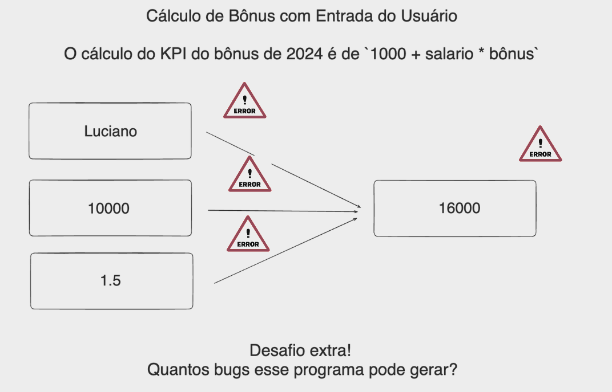

# Aula 02 - Exercicios

<details>
<summary><b>Inteiros (int)</b></summary>

 1. Escreva um programa que soma dois números inteiros inseridos pelo usuário.

    <details>
    <summary><b>🐍 Resposta</b></summary>
     
    ```python
    primeiro_numero = int(input("Insira o primeiro numero"))
    segundo_numero = int(input("Insira o segundo numero"))

    resultado = primeiro_numero + segundo_numero

    print(f"O Resultado é: {resultado}")
    ```
    </details>

2. Crie um programa que receba um número do usuário e calcule o resto da divisão desse número por 5.

    <details>
    <summary><b>🐍 Resposta</b></summary>

    ```python
    numero_usuario = int(input('Insira um numero qualquer:  '))

    resultado = numero_usuario % 5

    print(resultado)
    ```
    </details>

3. Desenvolva um programa que multiplique dois números fornecidos pelo usuário e mostre o resultado.

    <details>
    <summary><b>🐍 Resposta</b></summary>

    ```python
    primeiro_numero = int(input("Insira o primeiro numero"))
    segundo_numero = int(input("Insira o segundo numero"))

    calculo = primeiro_numero * segundo_numero
    resultado = calculo

    print(resultado)
    ```
    
    </details>

4. Faça um programa que peça dois números inteiros e imprima a divisão inteira do primeiro pelo segundo.

    <details>
    <summary><b>🐍 Resposta</b></summary>

    ```python
    primeiro_numero = int(input("Insira o primeiro numero"))
    segundo_numero = int(input("Insira o segundo numero"))

    calculo = primeiro_numero // segundo_numero
    resultado = calculo

    print(resultado)
    ```

    </details>

5. Escreva um programa que calcule o quadrado de um número fornecido pelo usuário.    

    <details>
    <summary><b>🐍 Resposta</b></summary>

    ```python
    primeiro_numero = int(input("Insira o primeiro numero"))

    calculo = primeiro_numero ** 2
    resultado = calculo

    print(resultado)
    ```

    </details>
</details>

---

<details>
<summary><b>Números de Ponto Flutuante (float)</b></summary>

6. Escreva um programa que receba dois números flutuantes e realize sua adição.
    
    <details>
    <summary><b>🐍 Resposta</b></summary>

    ```python
    primeiro_numero = float(input("Insira o primeiro numero"))
    segundo_numero = float(input("Insira o segundo numero"))

    resultado = primeiro_numero + segundo_numero

    print(f"O Resultado é: {resultado}")
    ```

    </details>

7. Crie um programa que calcule a média de dois números flutuantes fornecidos pelo usuário.

    <details>
    <summary><b>🐍 Resposta</b></summary>

    ```python
    primeiro_numero = float(input("Insira o primeiro numero"))
    segundo_numero = float(input("Insira o segundo numero"))

    soma = primeiro_numero + segundo_numero
    media = soma // 2
    resultado = media

    print(f"O Resultado é: {resultado}")
    ```

    </details>

8. Desenvolva um programa que calcule a potência de um número (base e expoente fornecidos pelo usuário).

    <details>
    <summary><b>🐍 Resposta</b></summary>

    ```python
    base = float(input("Insira o numero base: "))
    expoente = float(input("Insira o expoente: "))

    calculo = base ** expoente
    resultado = calculo

    print(f"O Resultado é: {resultado}")
    ```

    </details>

9. Faça um programa que converta a temperatura de Celsius para Fahrenheit.

    <details>
    <summary><b>🐍 Resposta</b></summary>

    ```python
    # F = C * 1,8 + 32
    temperatura = float(input("Insira a temperatura em Celsius para conversão em Fahrenheit: "))

    Fahrenheit = temperatura * 1.8 + 32
    resultado = Fahrenheit

    print(f"O Resultado é: {resultado}")
    ```

    </details>

10. Escreva um programa que calcule a área de um círculo, recebendo o raio como entrada.

    <details>
    <summary><b>🐍 Resposta</b></summary>

    ```python
    # A = pi * r ** 2
    import math 

    raio = float(input("Insira o raio do circulo: "))

    area_circulo = math.pi * raio ** 2
    resultado = area_circulo

    print(f"O Resultado é: {resultado:.2f}")
    ```

    </details>

</details>

---

<details>
<summary><b>Strings (str)</b></summary>

11. Escreva um programa que receba uma string do usuário e a converta para maiúsculas.

    <details>
    <summary><b>🐍 Resposta</b></summary>

    ```python
    texto = str(input("Insira um texto: "))

    conversão = texto.upper()

    print(conversão)
    ```

    </details>

12. Crie um programa que receba o nome completo do usuário e imprima o nome com todas as letras minúsculas.

    <details>
    <summary><b>🐍 Resposta</b></summary>

    ```python
    texto = str(input("Insira um texto: "))

    conversão = texto.lower()

    print(conversão)
    ```

    </details>

13. Desenvolva um programa que peça ao usuário para inserir uma frase e, em seguida, imprima esta frase sem espaços em branco no início e no final.

    <details>
    <summary><b>🐍 Resposta</b></summary>

    ```python
    texto = str(input("Insira uma frase: ")

    conversão = texto.replace(" ", "")

    print(f"{conversão}")
    ```

    </details>

14. Faça um programa que peça ao usuário para digitar uma data no formato "dd/mm/aaaa" e, em seguida, imprima o dia, o mês e o ano separadamente.

    <details>
    <summary><b>🐍 Resposta</b></summary>
        
    ```python
    data = str(input("Insira uma data: ")

    separação = data.split("/")

    dia = separação[:1]
    mes = separação[1:2]
    ano = separação[2:]

    print(dia)
    print(mes)
    print(ano)
    ```

    </details>

15. Escreva um programa que concatene duas strings fornecidas pelo usuário.

    <details>
    <summary><b>🐍 Resposta</b></summary>

    ```python
    texto_um = str(input("Insira um texto: "))
    texto_dois = str(input("Insira um texto: "))

    concatenacao = texto_um + texto_dois

    print(concatenacao)
    ```

    </details>

</details>

---

<details>
<summary><b>Booleanos (`bool`)</b></summary>

16. Escreva um programa que avalie duas expressões booleanas inseridas pelo usuário e retorne o resultado da operação AND entre elas.

    <details>
    <summary><b>🐍 Resposta</b></summary>

    ```python
    primeiro_valor = bool(input("Você gosta de nadar? "))
    segundo_valor = bool(input("Você gosta de filmes? "))

    calculo = primeiro_valor and segundo_valor
    resultado = calculo

    print(resultado)
    ```

    </details>

17. Crie um programa que receba dois valores booleanos do usuário e retorne o resultado da operação OR.

    <details>
    <summary><b>🐍 Resposta</b></summary>

    ```python
    primeiro_valor = bool(input("Você gosta de nadar? "))
    segundo_valor = bool(input("Você gosta de filmes? "))

    calculo = primeiro_valor or segundo_valor
    resultado = calculo

    print(resultado)
    ```

    </details>

18. Desenvolva um programa que peça ao usuário para inserir um valor booleano e, em seguida, inverta esse valor.

    <details>
    <summary><b>🐍 Resposta</b></summary>

    ```python
    valor = bool(input("Insira True or False? "))

    calculo = not valor
    resultado = calculo

    print(resultado)
    ```

    </details>

19. Faça um programa que compare se dois números fornecidos pelo usuário são iguais.

    <details>
    <summary><b>🐍 Resposta</b></summary>

    ```python
    primeiro_numero = float(input("Insira o primeiro numero"))
    segundo_numero = float(input("Insira o segundo numero"))

    calculo = primeiro_numero == segundo_numero
    resultado = calculo

    print(resultado)
    ```

    </details>

20. Escreva um programa que verifique se dois números fornecidos pelo usuário são diferentes.

    <details>
    <summary><b>🐍 Resposta</b></summary>

    ```python
    primeiro_numero = float(input("Insira o primeiro numero"))
    segundo_numero = float(input("Insira o segundo numero"))

    calculo = primeiro_numero != segundo_numero
    resultado = calculo

    print(resultado)
    ```

    </details>

</details>

---

<details>
<summary><b>Errors</b></summary>

21. Escreva um programa que converta a temperatura em Celsius e, utilizando try-except, garantir que a entrada seja numérica, tratando qualquer ValueError. Imprima o resultado em Fahrenheit ou uma mensagem de erro se a entrada não for válida.

    <details>
    <summary><b>🐍 Resposta</b></summary>

    ```python
    # F = C * 1,8 + 32
    try:
        temperatura = float(input("Insira a temperatura em Celsius para conversão em Fahrenheit: "))
        Fahrenheit = temperatura * 1.8 + 32
        resultado = Fahrenheit
        print(f"O Resultado é: {resultado}")

    except ValueError as e:
        print(f"Entrada não valida")
    ```

    </details>

22. Crie um programa que verifica se uma palavra ou frase é um palíndromo (lê-se igualmente de trás para frente, desconsiderando espaços e pontuações). Utilize try-except para garantir que a entrada seja uma string. Dica: Utilize a função isinstance() para verificar o tipo da entrada.

    <details>
    <summary><b>🐍 Resposta</b></summary>

    ```python
    try:
        entrada = input("Digite uma palavra ou frase: ").replace(" ", "").lower()
        if not entrada:
            raise ValueError("A entrada não pode estar vazia.")

        if entrada.isalpha():
            if entrada == entrada[::-1]:
                print("É um palíndromo.")
            else:
                print("Não é um palíndromo.")
        else:
            print("Entrada inválida. Por favor, use apenas letras.")

    except KeyboardInterrupt:
        print("\nO programa foi interrompido pelo usuário.")
    except ValueError as e:
        print(f"Erro de valor: {e}")
    except Exception as e:
        print(f"Ocorreu um erro inesperado: {e}")
    ```

    </details>

23. Desenvolva uma calculadora simples que aceite duas entradas numéricas e um operador (+, -, *, /) do usuário. Use try-except para lidar com divisões por zero e entradas não numéricas. Utilize if-elif-else para realizar a operação matemática baseada no operador fornecido. Imprima o resultado ou uma mensagem de erro apropriada.

    <details>
    <summary><b>🐍 Resposta</b></summary>

    ```python
    entrada_um = float(input("Insira o primeiro Numero: "))
    operador = input("Insira o operador desejado(-,+,*,/): ")
    entrada_dois = float(input("Insira o segundo Numero: "))

    resultado = 0

    try:
        if not entrada_um or not entrada_dois:
            raise ValueError("A entrada não pode estar vazia.")
        
        if operador == "-":
            resultado = entrada_um - entrada_dois
            print(resultado)
        elif operador == "+":
            resultado = entrada_um + entrada_dois
            print(resultado)
        elif operador == "*":
            resultado = entrada_um * entrada_dois
            print(resultado)
        elif operador == "/":
            resultado = entrada_um / entrada_dois
            print(resultado)
        else:
            print("Entre com um operador valido!")

    except ValueError as e:
        print(f"Erro de valor: {e}")
    except KeyboardInterrupt:
        print("\nO programa foi interrompido pelo usuário.")
    except Exception as e:
        print(f"Ocorreu um erro inesperado: {e}")
    ```

    </details>

24. Classificador de Números. Escreva um programa que solicite ao usuário para digitar um número. Utilize try-except para assegurar que a entrada seja numérica e utilize if-elif-else para classificar o número como "positivo", "negativo" ou "zero". Adicionalmente, identifique se o número é "par" ou "ímpar".

    <details>
    <summary><b>🐍 Resposta</b></summary>

    ```python
    entrada = input("Digite um Numero: ")

    try:
        if not entrada:
            raise ValueError("A entrada não pode estar vazia.")
        
        if entrada.isdigit():

            if float(entrada) % 2 == 0:
                resultado = "PAR"
            else:
                resultado = "ÍMPAR"

            if float(entrada) < 0:
                print(f"O número inserido é {resultado} e negativo")
            elif float(entrada) > 0:
                print(f"O número inserido é {resultado} e positivo")
            elif float(entrada) == 0:
                print(f"O número inserido é {resultado} e zero")
        else:
            print("Entrada Inválida. Insira um valor numérico.")
        
    except ValueError as e:
        print(f'[ERRO]: {e}')
    except KeyboardInterrupt:
        print("\nO programa foi interrompido pelo usuário.")
    except Exception as e:
        print(f"Ocorreu um erro inesperado: {e}")
    ```

    </details>


25. Conversão de Tipo com Validação. Crie um script que solicite ao usuário uma lista de números separados por vírgula. O programa deve converter a string de entrada em uma lista de números inteiros. Utilize try-except para tratar a conversão de cada número e validar que cada elemento da lista convertida é um inteiro. Se a conversão falhar ou um elemento não for um inteiro, imprima uma mensagem de erro. Se a conversão for bem-sucedida para todos os elementos, imprima a lista de inteiros.

    <details>
    <summary><b>🐍 Resposta</b></summary>

    ```python
    entrada = input('Insira uma lista de numeros separados por vírgula: ')

    erro_encontrado = False
    lista_resultado = []

    try:

        if not entrada:
            raise ValueError("Lista Vazia. Gentileza Preencher com valores inteiros")
        
        if not "," in entrada:
            raise ValueError("A Lista deve ser separada por vírgula (,)")
        
        entrada = entrada.split(',')

        for i in entrada:
            item = i.strip()
            if item.isdigit() or (item.startswith('-') and item[1:].isdigit()):
                lista_resultado.append(int(item))  
            else:
                erro_encontrado = True
                break
        print(lista_resultado)
    except ValueError as e:
        print(f'[ERRO]: {e}')
    except erro_encontrado == True:
        print("Insira uma lista de numeros inteiros")
    except KeyboardInterrupt:
        print("\nO programa foi interrompido pelo usuário.")
    except Exception as e:
        print(f"Ocorreu um erro inesperado: {e}")
    ```

    </details>

</details>

---

<details>
<summary><b>Desafio - Quais os possiveis erros que podem ser gerados?</b></summary>



<details>
<summary><b>🐍 Resposta</b></summary>

```python
    try:
        
        nome = input("Digite o seu nome: ").strip()
        if not nome:
            raise ValueError("Valor Vazio. Gentileza Preencher com valores inteiros")
        if not nome.replace(" ", "").isalpha():
            raise ValueError("Valor Inválido no Campo Nome. Gentileza inserir nome em formato de texto")
        
        
        salario = input("Digite o valor do seu salário: ").strip()
        if not salario:
            raise ValueError("Valor Vazio. Gentileza Preencher com valores inteiros")
        if not salario.isdigit():
            raise ValueError("Valor Inválido no Campo Salario. Gentileza inserir salario em formato de numero")
        salario = int(salario)
        
        bonus = input("Insira o valor do bonus: ").strip()
        if not bonus:
            raise ValueError("Valor Vazio. Gentileza Preencher com valores inteiros")    
        if not bonus.isdigit():
            raise ValueError("alor Inválido no Campo bonus. Gentileza inserir bonus em formato de numero")
        bonus = int(bonus)

        bonus_final = 1000 + salario + bonus
        print(bonus_final)

        print(f"O {nome} recebeu um salario de {salario} e um bonus de {bonus}% e obteve no final um bonus total de {bonus_final}")
        
    except ValueError as e:
        print(f"[ERRO]: {e}")
```

</details>
</details>


